# Architecture Documentation
## Swiss Weather Sport Planner

### System Overview

The Swiss Weather Sport Planner is a single-page web application built with Django that provides real-time weather-based sport recommendations for outdoor activities in Reinach BL, Switzerland.

## High-Level Architecture

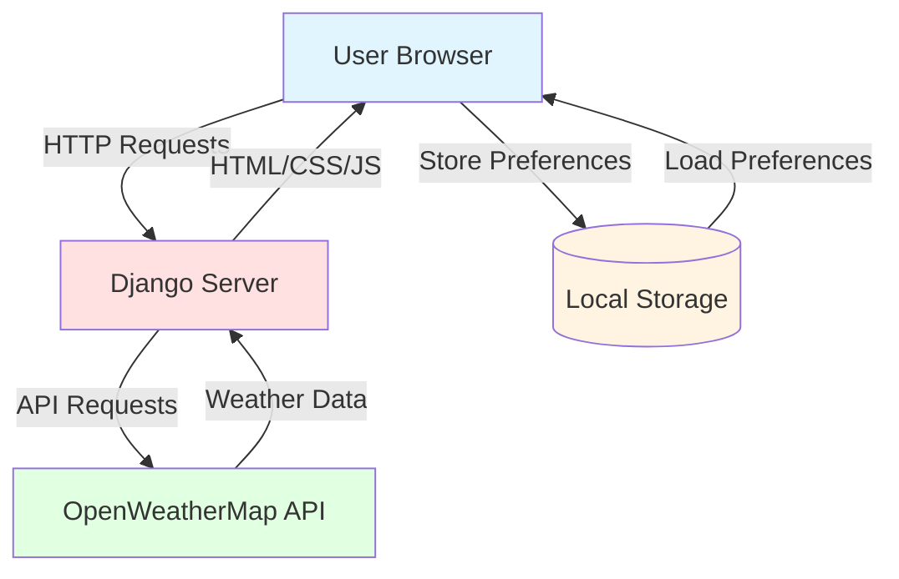

## Component Architecture

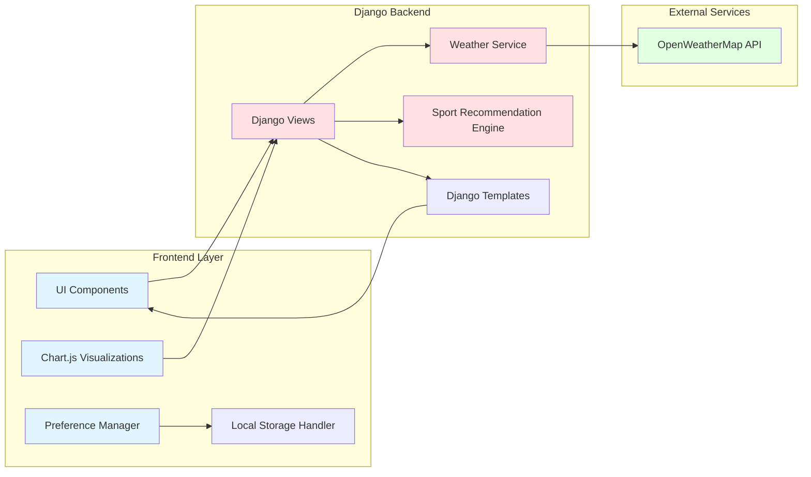

## Data Flow Architecture

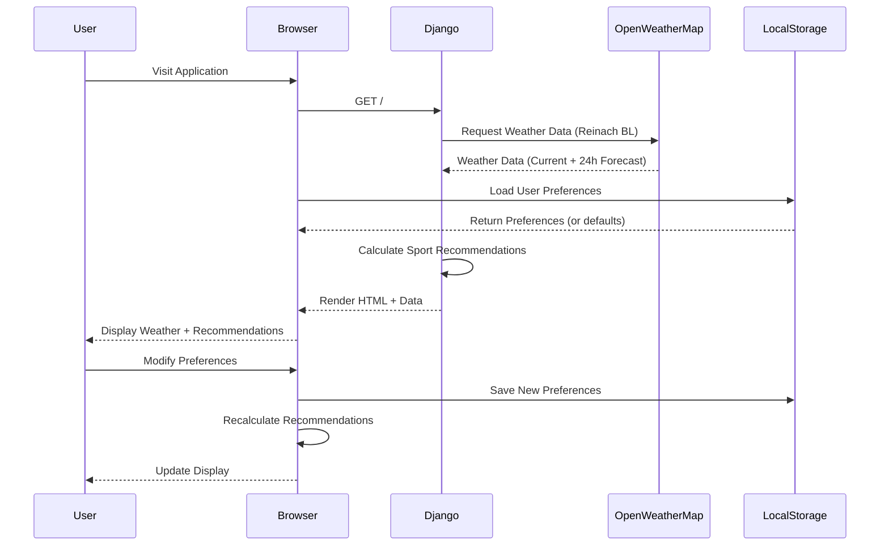

## Application Layer Structure

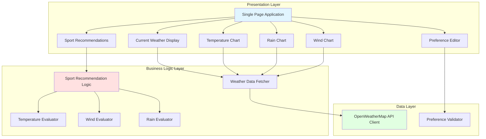

## Sport Recommendation Logic Flow

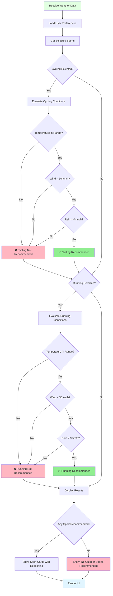

## User Preference Management

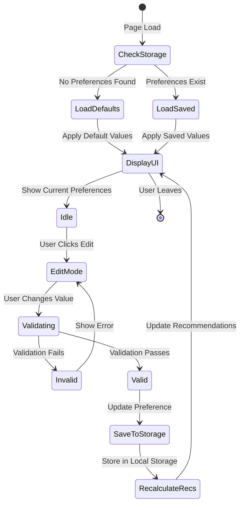

## Technology Stack Diagram

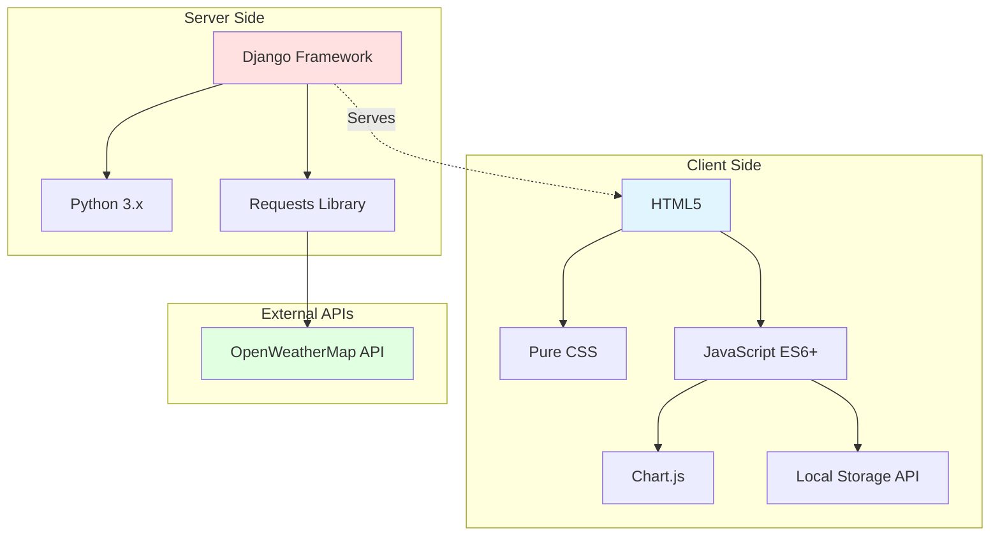

## Deployment Architecture

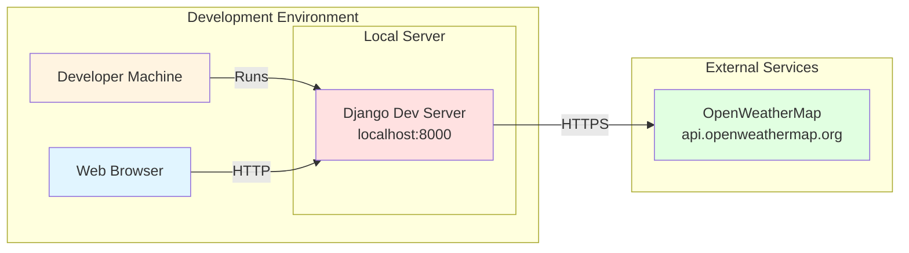

## File Structure

```
trivium-ai/
├── manage.py                      # Django management script
├── PRD.md                         # Product Requirements Document
├── ARCHITECTURE.md                # This file
│
├── weather_project/               # Django project directory
│   ├── __init__.py
│   ├── settings.py                # Django settings
│   ├── urls.py                    # URL routing
│   └── wsgi.py                    # WSGI configuration
│
├── weather_app/                   # Django application
│   ├── __init__.py
│   ├── views.py                   # View logic
│   ├── services/
│   │   ├── __init__.py
│   │   ├── weather_service.py     # OpenWeatherMap API integration
│   │   └── sport_service.py       # Sport recommendation logic
│   ├── templates/
│   │   └── index.html             # Single page template
│   └── static/
│       ├── css/
│       │   └── styles.css         # Pure CSS styling
│       └── js/
│           ├── charts.js          # Chart.js visualizations
│           ├── preferences.js     # Preference management
│           └── main.js            # Main application logic
│
└── requirements.txt               # Python dependencies
```

## API Integration Architecture

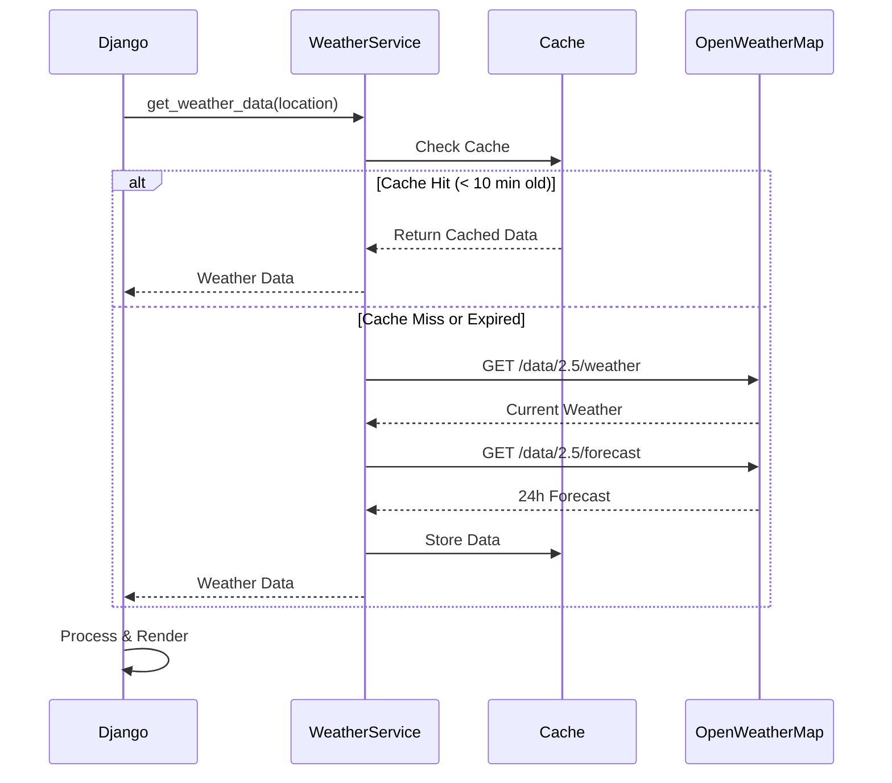

## Security Considerations

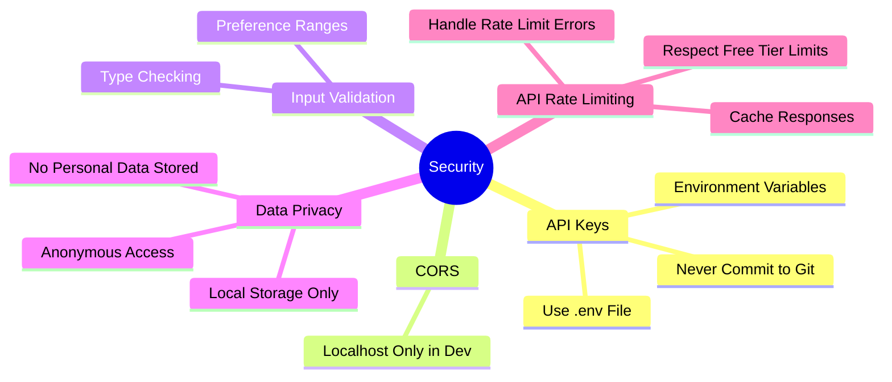

## Performance Optimization Strategy

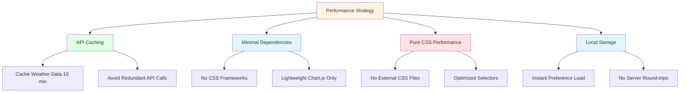

## Error Handling Flow

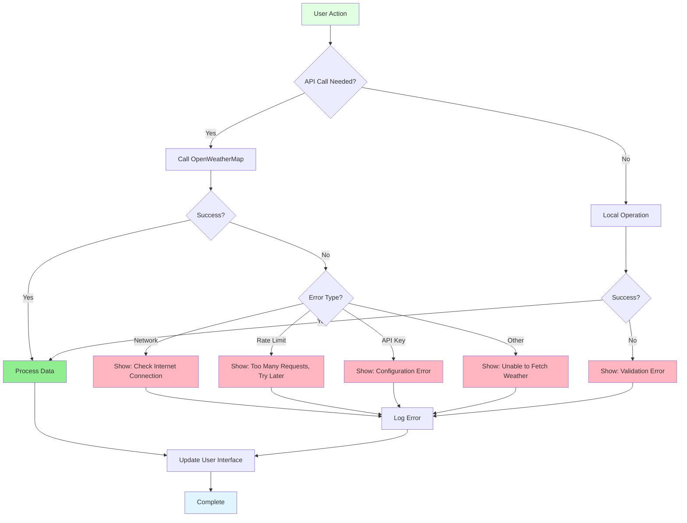
