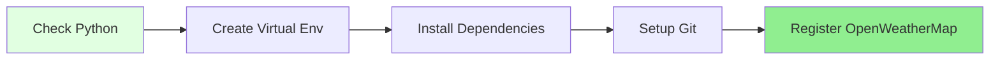
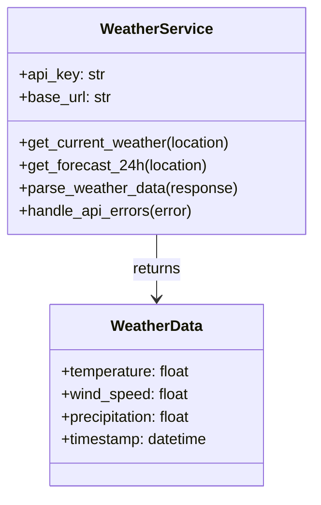
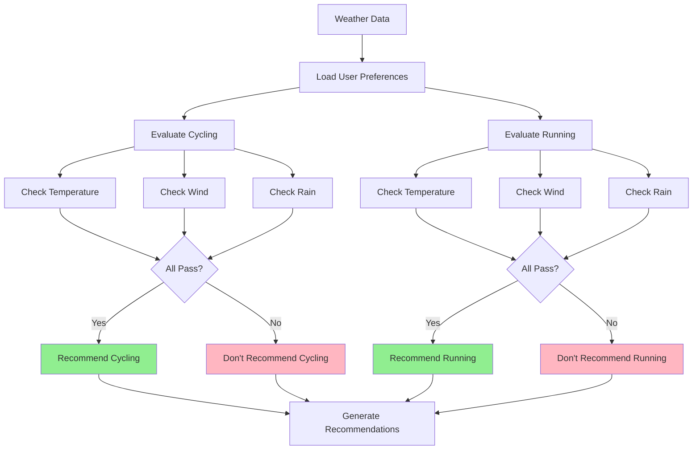
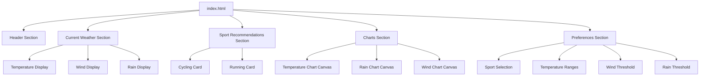
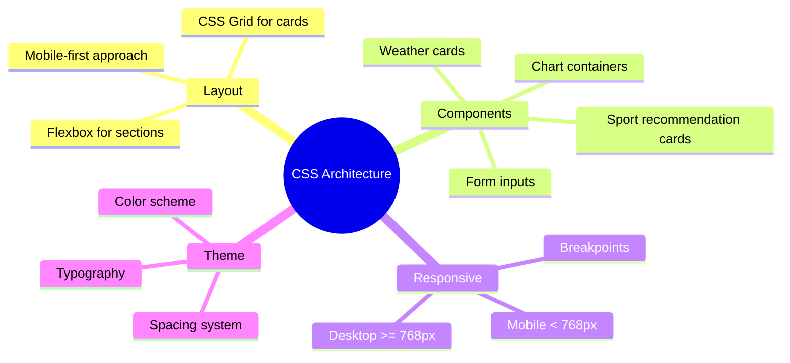
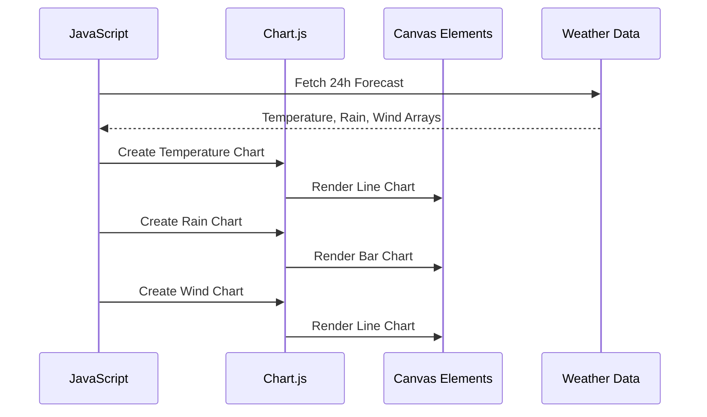
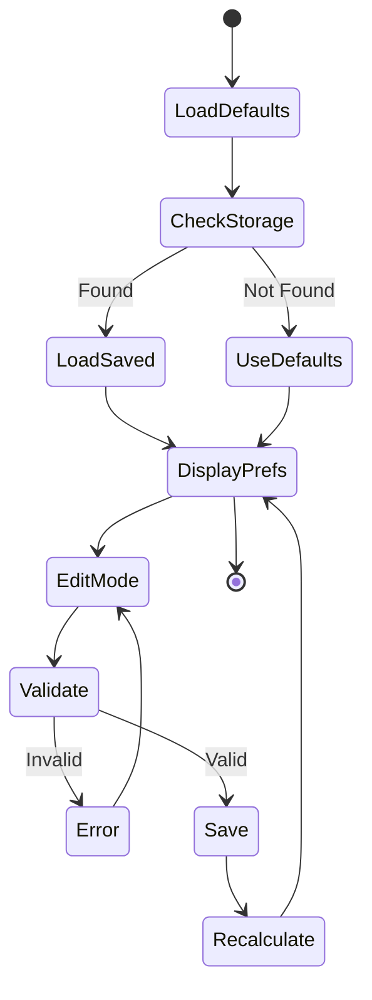
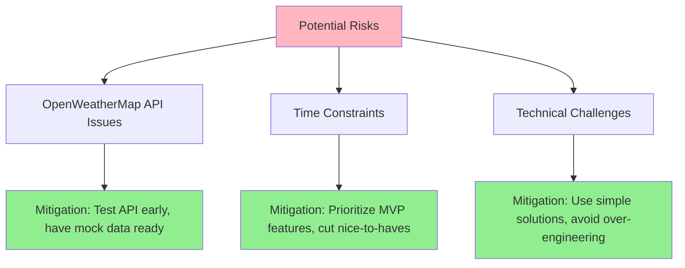

# Project Roadmap
## Swiss Weather Sport Planner

### Project Timeline: 1 Day (Today)

This roadmap breaks down the one-day development timeline into manageable phases with clear milestones and deliverables.

---

## Overview Timeline

```mermaid
gantt
    title Swiss Weather Sport Planner - One Day Development
    dateFormat HH:mm
    axisFormat %H:%M
    
    section Setup
    Environment Setup           :setup1, 09:00, 1h
    Django Project Init        :setup2, after setup1, 30m
    
    section Backend
    Weather Service            :backend1, after setup2, 1h
    Sport Logic               :backend2, after backend1, 1h
    Django Views              :backend3, after backend2, 45m
    
    section Frontend
    HTML Structure            :frontend1, after backend3, 45m
    CSS Styling              :frontend2, after frontend1, 1h
    JavaScript Logic         :frontend3, after frontend2, 1h
    
    section Integration
    Charts Integration       :integrate1, after frontend3, 1h
    Preferences System       :integrate2, after integrate1, 45m
    
    section Testing
    Testing & Bug Fixes      :test1, after integrate2, 1h
    Final Polish            :test2, after test1, 30m
```



---

## Phase 1: Environment Setup (1.5 hours)

### Milestone 1.1: Development Environment (1 hour)


**Tasks:**
- [x] Verify Python 3.x installation (`python3 --version`)
- [x] Create virtual environment
  ```bash
  python3 -m venv venv
  source venv/bin/activate
  ```
- [x] Create `requirements.txt`:
  ```
  Django>=4.2
  requests>=2.31.0
  python-decouple>=3.8
  ```
- [x] Install dependencies: `pip install -r requirements.txt`
- [x] Initialize git repository
- [x] Register for OpenWeatherMap API (https://openweathermap.org/api)
- [x] Save API key for later use

**Deliverables:**
- ✅ Working Python environment (Python 3.14.1)
- ✅ Virtual environment activated
- ✅ All dependencies installed (Django 5.2.9, requests 2.32.5, python-decouple 3.8)
- ✅ OpenWeatherMap API key obtained and stored in .env

---

### Milestone 1.2: Django Project Setup (30 minutes)

**Tasks:**
- [x] Create Django project: `django-admin startproject weather_project .`
- [x] Create Django app: `python manage.py startapp weather_app`
- [x] Configure `settings.py`:
  - Add `weather_app` to `INSTALLED_APPS`
  - Configure static files
  - Set up environment variables for API key
- [x] Create `.env` file for API key
- [x] Create `.gitignore` (include `.env`, `venv/`, `__pycache__/`, etc.)
- [x] Test server: `python manage.py runserver`

**Deliverables:**
- ✅ Django project structure created
- ✅ Development server running at http://127.0.0.1:8000/
- ✅ API key stored securely in .env file
- ✅ weather_app added to INSTALLED_APPS
- ✅ Static files directory configured

---

## Phase 2: Backend Development (2.75 hours)

### Milestone 2.1: Weather Service Integration (1 hour)



**Tasks:**
- [x] Create `weather_app/services/` directory
- [x] Implement `weather_service.py`:
  - API client class
  - Get current weather for Reinach BL
  - Get 24-hour forecast
  - Parse API response
  - Error handling (network, rate limit, invalid key)
  - Basic caching (10 minutes)
- [x] Test API integration manually
- [x] Handle Reinach BL coordinates (lat: 47.4953, lon: 7.5965)

**Deliverables:**
- ✅ Working OpenWeatherMap integration
- ✅ Current weather data retrieval (temperature, wind, precipitation, humidity)
- ✅ 24-hour forecast data retrieval (8 x 3-hour intervals)
- ✅ Error handling implemented (timeout, HTTP errors, rate limits)
- ✅ 10-minute caching implemented
- ✅ Test script created and verified

---

### Milestone 2.2: Sport Recommendation Engine (1 hour)



**Tasks:**
- [x] Create `sport_service.py`:
  - Default thresholds:
    - Cycling: 15-25°C, wind < 30km/h, rain = 0mm/h
    - Running: 10-20°C, wind < 30km/h, rain < 3mm/h
  - Sport evaluation logic
  - Recommendation generator
  - Reasoning text generator
- [x] Unit tests for recommendation logic
- [x] Handle edge cases (no sports recommended)

**Deliverables:**
- ✅ Sport recommendation logic working
- ✅ Default thresholds implemented
- ✅ Reasoning messages generated
- ✅ Edge cases handled
- ✅ Comprehensive test suite with 8 test scenarios
- ✅ Custom threshold support implemented
- ✅ Forecast recommendation support added

---

### Milestone 2.3: Django Views & URLs (45 minutes)

**Tasks:**
- [x] Create main view in `views.py`:
  - Fetch weather data
  - Get sport recommendations
  - Prepare data for template
  - Handle errors gracefully
- [x] Configure URL routing in `urls.py`
- [x] Create simple template structure
- [x] Test view renders correctly

**Deliverables:**
- ✅ Main view implemented
- ✅ URL routing configured
- ✅ Basic page renders

---

## Phase 3: Frontend Development (2.75 hours)

### Milestone 3.1: HTML Structure (45 minutes)



**Tasks:**
- [ ] Create `templates/index.html`:
  - Semantic HTML5 structure
  - Current weather display
  - Sport recommendation cards
  - Three chart containers
  - Preference editor form
  - Mobile-friendly meta tags
- [ ] Django template tags for dynamic data
- [ ] Form inputs for preferences

**Deliverables:**
- ✅ Complete HTML structure
- ✅ All sections present
- ✅ Template tags working

---

### Milestone 3.2: CSS Styling (1 hour)



**Tasks:**
- [ ] Create `static/css/styles.css`:
  - CSS reset/normalize
  - Mobile-first responsive layout
  - Current weather styling
  - Sport recommendation cards (side by side)
  - Chart container styling
  - Preference form styling
  - Color scheme (weather-themed)
  - Typography hierarchy
  - Hover states and interactions
- [ ] Test on mobile viewport
- [ ] Test on desktop viewport

**Deliverables:**
- ✅ Complete pure CSS styling
- ✅ Mobile-responsive design
- ✅ Professional appearance

---

### Milestone 3.3: JavaScript Core Logic (1 hour)

**Tasks:**
- [ ] Create `static/js/main.js`:
  - Page initialization
  - Fetch weather data from Django
  - Update UI with weather data
  - Update sport recommendations
  - Event listeners for preference changes
- [ ] Create `static/js/preferences.js`:
  - Load preferences from localStorage
  - Save preferences to localStorage
  - Validate preference inputs
  - Default values object
  - Preference change handlers
- [ ] Error handling and user feedback
- [ ] Loading states

**Deliverables:**
- ✅ Interactive JavaScript working
- ✅ Preferences save/load functioning
- ✅ Real-time UI updates

---

## Phase 4: Integration (1.75 hours)

### Milestone 4.1: Charts Implementation (1 hour)



**Tasks:**
- [ ] Add Chart.js CDN to template
- [ ] Create `static/js/charts.js`:
  - Temperature chart (line chart, 24 hours)
  - Rain chart (bar chart, 24 hours)
  - Wind chart (line chart, 24 hours)
  - Chart configuration and styling
  - Responsive chart sizing
  - Update chart function
- [ ] Format data for Chart.js
- [ ] Add chart legends and labels
- [ ] Test chart rendering

**Deliverables:**
- ✅ Three charts rendering correctly
- ✅ 24-hour forecast visualization
- ✅ Charts responsive to screen size

---

### Milestone 4.2: Preferences Integration (45 minutes)



**Tasks:**
- [ ] Integrate preference system with sport recommendations
- [ ] Real-time recalculation when preferences change
- [ ] Persist preferences on every change
- [ ] Add reset to defaults button
- [ ] Validate all inputs (ranges, types)
- [ ] User feedback for invalid inputs
- [ ] Test preference persistence across page reloads

**Deliverables:**
- ✅ Preferences fully integrated
- ✅ Real-time recommendation updates
- ✅ Validation working
- ✅ Persistence confirmed

---

## Phase 5: Testing & Polish (1.5 hours)

### Milestone 5.1: Testing & Bug Fixes (1 hour)

**Test Checklist:**
- [ ] Weather data displays correctly
- [ ] Sport recommendations accurate
- [ ] All three charts render
- [ ] Preferences save and load
- [ ] Mobile responsive design works
- [ ] Error handling displays messages
- [ ] No console errors
- [ ] API rate limiting handled
- [ ] Default values work
- [ ] Edge cases handled (no sports recommended)

**Tasks:**
- [ ] Manual testing on desktop
- [ ] Manual testing on mobile (or browser dev tools)
- [ ] Test with different preference combinations
- [ ] Test error scenarios:
  - Network offline
  - Invalid API key
  - Rate limit exceeded
- [ ] Fix any bugs found
- [ ] Cross-browser testing (Chrome, Safari, Firefox)

**Deliverables:**
- ✅ All features tested
- ✅ Bugs fixed
- ✅ Error scenarios handled

---

### Milestone 5.2: Final Polish (30 minutes)

**Tasks:**
- [ ] Code cleanup and comments
- [ ] Remove console.log statements
- [ ] Optimize CSS (remove unused rules)
- [ ] Add loading indicators
- [ ] Improve error messages
- [ ] Add helpful tooltips
- [ ] Final UI tweaks
- [ ] Update README.md with setup instructions
- [ ] Document API key setup
- [ ] Take screenshots for documentation

**Deliverables:**
- ✅ Clean, documented code
- ✅ Professional UI
- ✅ Complete documentation

---

## Project Completion Checklist

### Core Features
- [ ] Real-time weather data from OpenWeatherMap
- [ ] Current weather display for Reinach BL
- [ ] 24-hour forecast visualization (3 charts)
- [ ] Cycling recommendation logic
- [ ] Running recommendation logic
- [ ] Sport recommendation display with reasoning
- [ ] User preference customization
- [ ] Local storage persistence
- [ ] Mobile-responsive design

### Technical Requirements
- [ ] Django backend running
- [ ] Pure CSS styling (no frameworks)
- [ ] Chart.js integration
- [ ] Error handling implemented
- [ ] API key stored securely
- [ ] No database dependencies

### Documentation
- [ ] PRD.md complete
- [ ] ARCHITECTURE.md complete
- [ ] ROADMAP.md complete (this file)
- [ ] README.md with setup instructions
- [ ] Code comments in complex sections

### Testing
- [ ] Manual testing completed
- [ ] Mobile responsive verified
- [ ] Error scenarios tested
- [ ] Cross-browser compatibility checked

---

## Risk Management



---

## Success Criteria

At the end of today, the project is successful if:
1. ✅ Weather data displays for Reinach BL
2. ✅ Sport recommendations work based on weather
3. ✅ Three charts show 24-hour forecasts
4. ✅ User can customize preferences
5. ✅ Preferences persist in browser
6. ✅ Works on mobile and desktop
7. ✅ Error handling prevents crashes
8. ✅ Code is documented

---

## Next Steps (Future Enhancements - Out of Scope for Today)

- [ ] Add more sports (hiking, skiing, swimming)
- [ ] Support multiple locations
- [ ] Weather alerts/notifications
- [ ] Historical weather data
- [ ] User accounts and cloud sync
- [ ] Progressive Web App (PWA)
- [ ] Share recommendations on social media
- [ ] Export weather data as CSV/PDF
- [ ] Dark mode theme
- [ ] Multi-language support

---

## Notes

- This is a **learning project**, so take time to understand concepts
- **Ask questions** when stuck rather than struggling alone
- **Test frequently** - don't wait until the end
- **Commit regularly** to git with meaningful messages
- **Focus on MVP** - additional features can be added later
- **Have fun!** This is about learning Django and building something useful

---

**Start Time:** Morning (approximately 9:00 AM)  
**Estimated Completion:** Evening (approximately 7:00 PM)  
**Total Duration:** ~10 hours with breaks
